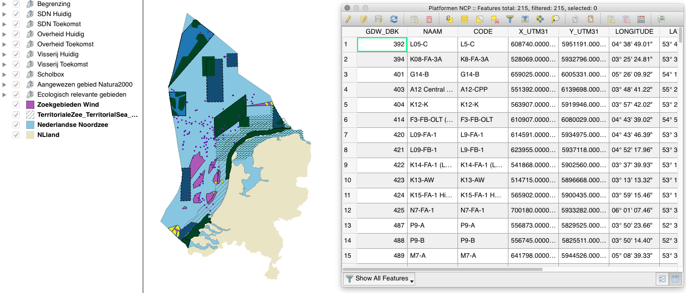

# FarmHack 

[FarmHack](farmhack.nl) mobiliseert coders, creatieven en domeinexperts op vraagstukken van de boer. (en hier: de visser.)

## VisHack 2018

Een belangrijke stap voor een nog duurzamer visserij is het terugdringen van de hoeveelheid ongewenste bijvangst. Stichting De Noordzee wil samen met de visserijsector innovatie in de bodemvisserij aanjagen. Deze 'VisHack' biedt ruimte aan ideeen en talent om samen mooie dingen te maken.  

Meer informatie: https://www.farmhack.nl/activiteiten/vishack/

## Data

### Stichting De Noordzee

Download: [Beschermde Gebieden op Zee](https://stichtingdenoordzee.sharepoint.com/Beschermde%20Natuurgebieden/Gedeelde%20%20documenten/Forms/AllItems.aspx?slrid=f677519e%2De0c9%2D5000%2D79c4%2D79731fcf8a06&RootFolder=%2FBeschermde%20Natuurgebieden%2FGedeelde%20%20documenten%2FNAT%5FBeleidstrajecten%20en%20gebieden%2FKaartjes%2FBescherming%20Noordzee%2FShapefiles%20Bescherming%20Noordzee%20Vishack&FolderCTID=0x012000F097317C015FB64D8F0C14D52E00C9CE)

Gebruik: Download de `layers` map, en de `.qgs` bestand en open deze in [QGIS](http://qgis.com/). QGIS kan de lagen als GeoJSON of CSV exporteren: selecteer een laag -> rechtermuisknop -> `Save As...` -> `Format`: (GeoJSON/CSV) -> `Ok`. Selecteer `CRS`: `EPSG:4326` als de data op een Leaflet/Google Maps kaart gevisualiseerd gaat worden.

Disclaimer: this dataset was used for [North Sea Foundation's publication (Feb 2018) on Marine Protected Areas](https://www.noordzee.nl/marine-protected-areas-in-the-dutch-north-sea/). The data contains proposals for Marine Protected Areas that are not yet implemented (Klaverbank, Friese Front, Centrale Oestergronden, Borkumse Stenen). The Dutch government is not responsible for errors or information that is not up to date.

### The International Council for the Exploration of the Sea

Download: https://datras.ices.dk/Data_products/Download/Download_Data_public.aspx

De surveys die voor de Noordzee het meest geschikt zijn zijn IBTS (International Bottom Trawl Survey) en BTS (Beam Trawl Survey). Datras biedt twee soorten gegevens aan: de ruwe exchange data en de CPUE per length per haul.

De exchange data is de meest uitgebreidde vorm van de data, maar vergt nogal wat achtergrond kennis wat betreft de interpretatie, zie hiervoor de [documentatie](https://datras.ices.dk/Data_products/ReportingFormat.aspx).

 De CPUE per length per haul vergt minder achtergrondkennis. Zoek naar “CPUE per length per hour and swept area” in het portaal.

Die twee sets lijken op elkaar maar de BTS set is net iets uitegbreider. Voor de IBTS zitten de “nultrekken” (de trekken waar geen vis van de soort waar je geinteresseerd in bent) in de dataset. Die trekken worden gekenmerkt door een lengte waarneming van 0 mm met een waarde van 0.

### Overig

[Informatiehuis Marien](https://www.informatiehuismarien.nl/open-data/) - Het informatiehuis Marien werkt nauw samen met diverse partijen die data inzamelen op de Noordzee. Zo wordt de data ontsluiting van diverse projecten ondersteund door het platform Mariene monitoring (PMM). Meer informatie over PMM vindt u op deze site onder het tabblad projecten. Ook ander projecten zoals de Noordzeeboerderij en de monitoring van Oceana tonen hun data bij het IHM. Wageningen Marine Research (WMR) stelt haar open data onder het uitklapmenu "Reguliere monitoring" ter beschikking en Rijkswaterstaat stelt haar vaste zoutwatermonitoring ook hier beschikbaar.

#### Rapporten

- [Discard Atlas of North Sea fisheries](http://www.nsrac.org/wp-content/uploads/2014/11/discardatlas_northsea_demersalfisheries_2014.pdf) \[PDF]
- [Discard self-sampling of Dutch bottom-trawl and seine fisheries in 2011](http://edepot.wur.nl/239432) \[PDF]
- [Discard self-sampling of Dutch bottom-trawl and seine fisheries in 2013](http://edepot.wur.nl/324110) \[PDF]

## Challenges

### ONTWIJKEN - realtime visualisatie en communicatie

Kunnen vissers gebruik maken van ruimtelijke data en communicatietechnologie om ongewenste bijvangst te vermijden? Als een visser weet waar veel ongewenste bijvangst is of waar de vis zit die hij wél wil vangen, kan hij gerichter vissen en bijvangst vermijden. Deze challenge is gericht op een oplossing die gebruik maakt van real time informatie en ruimtelijke data over de verspreiding van ongewenste bijvangst.

### ONTSNAPPEN - net aanpassingen en verschillen tussen vissen

Kunnen visnetten zo getweakt worden dat ze geen jonge vis of andere ongewenste bijvangst opvangen? Als een visnet zo gemaakt wordt dat er alleen maar vis in terecht komt die de visser wil, kan hij op een efficiëntere manier een goede vangst binnenhalen.

### OVERLEVEN - behandeling in het net en aan boord

Kan de ongewenste bijvangst die in het net terecht komt zo behandeld worden dat de vis dit proces overleeft zonder schade op te lopen? Het terugzetten van ongewenste bijvangst in zee zou geen probleem zijn als deze vissen het overleven. Hoe kan data over vis bijdragen aan het maximaliseren van de overlevingskans?

### BENUTTEN - onvermijdelijke bijvangst zo goed mogelijk verkopen

Kan bijvangst minder ongewenst gemaakt worden, bijvoorbeeld door slimme verwerkingsmethodes of door visser en consument beter aan elkaar te linken? Veel bijvangst bestaat uit jonge vis, of uit onbruikbare of gevoelige soorten. Maar er wordt ook vis bijgevangen die in principe wel eetbaar is, maar economisch minder oplevert. In deze challenge gaan deelnemers op zoek naar manieren om de onvermijdelijke, bruikbare maar economisch niet rendabele bijvangst optimaal te benutten.
